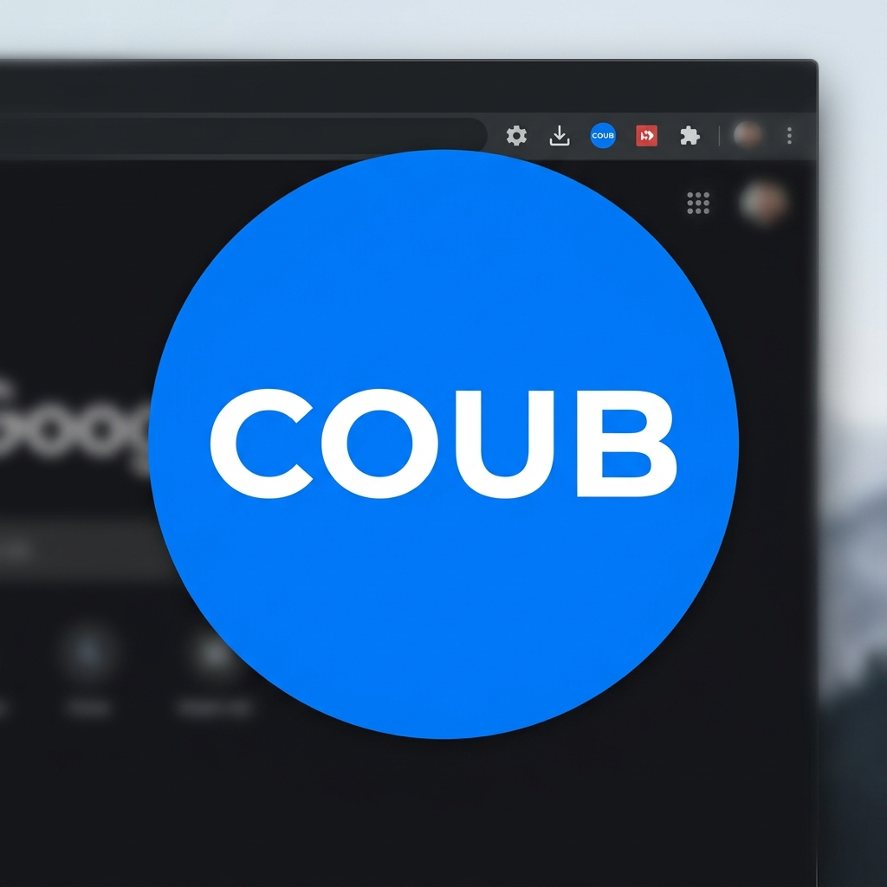

#  Coub Explorer for VS Code

Enjoy short, looping videos from Coub directly in your VS Code panel!

## Features

- **Endless Feed**: Browse Hot, Random, Rising and Fresh coubs.
- **TikTok-style Auto-Play**: Automatically advanced to the next coub when the track ends.
- **Direct Control**: Use clicking on the video to play/pause.
- **High Quality**: Uses direct high-quality video and audio streams.
- **Glassmorphism UI**: Modern and sleek interface integrated with VS Code themes.

## How to use

1. Install the extension.
2. Click the Coub Explorer icon in the Panel area (usually bottom).
3. Click "Click to Unmute & Start" to activate sound and autoplay.
4. Use the "Next" button in the title bar or the Auto-Play toggle to browse.

## License
MIT
